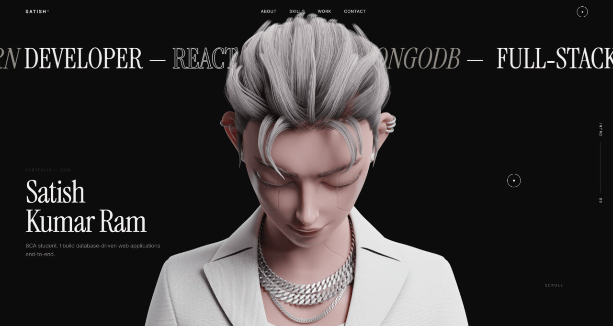

# 🎬 Animated Portfolio

A cinematic, scroll-driven personal portfolio built with **HTML**, **CSS**, and **JavaScript**. Inspired by premium interactive websites, the portfolio combines smooth scrolling, canvas image-sequence animation, and modern UI design to create an immersive browsing experience.



---

## ✨ Features

- 🎥 Scroll-controlled canvas animation
- ⚡ Smooth scrolling experience
- 🎨 Modern minimalist UI
- 📱 Responsive design
- 🖱️ Custom cursor interactions
- ✨ GSAP-powered animations
- 🚀 Optimized image sequence rendering
- 💻 Clean and modular project structure

---

## 🛠️ Built With

- HTML5
- CSS3
- JavaScript (ES6)
- GSAP
- ScrollTrigger
- Lenis Smooth Scroll

---

## 📂 Project Structure

```
Animated/
│
├── assets/
│   ├── images/
│   └── sequence/
│
├── css/
│   ├── global.css
│   ├── hero.css
│   ├── about.css
│   ├── projects.css
│   └── contact.css
│
├── js/
│   ├── main.js
│   ├── scroll.js
│   ├── animation.js
│   ├── canvas.js
│   └── cursor.js
│
├── legacy/
│
├── index.html
└── Skill.md
```

---

## 🚀 Getting Started

Clone the repository:

```bash
git clone https://github.com/Satish01-oss/Animated-Portfolio.git
```

Navigate to the project:

```bash
cd Animated-Portfolio
```

Open `index.html` in your browser or use **Live Server** in VS Code.

---

## 📸 Highlights

- Smooth scroll-driven storytelling
- Canvas-based frame animation
- Responsive layout
- Performance-focused rendering
- Premium portfolio experience

---

## 📬 Contact

Feel free to connect with me.

- GitHub: https://github.com/Satish01-oss
- LinkedIn: *https://www.linkedin.com/in/satish-kumar-ram-468a5b321/*
- Email: *ss7233563@gmail.com*

---

## 📄 License

This project is open source and available under the **MIT License**.

---

### ⭐ If you like this project, consider giving it a star!
